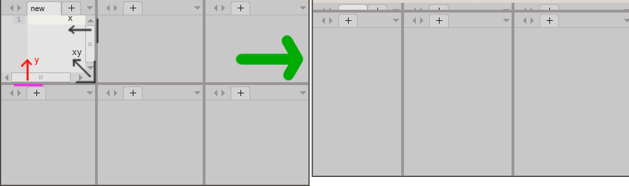
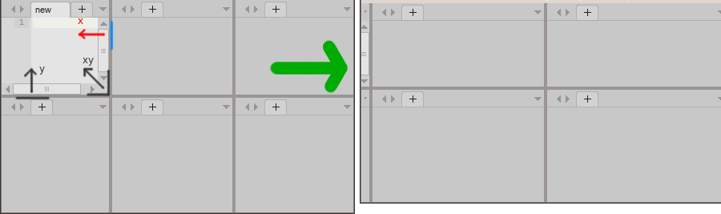
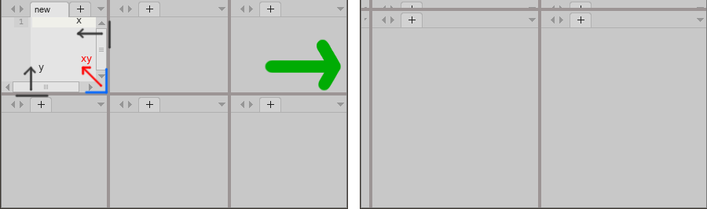

# Tab Group Resizer

Plugin for CudaText.
Adds commands to toggle-maximize and minimize current tab group.

Plugin has options in the config file, call menu item "Options / Settings-pligins / Tab Group Resizer".
Options are: 

- 'option_min_focus': focus change on 'Minimize' command:
	* 0 - focus stays in minimized editor, calling 'Minimize' again will expand the group
	* 1 - last activated non-minimized editor will get focus 
- 'minimize_preference': for corner groups (layouts '4 grid' and '6 grid') dictates which way to minimize. Possible values:
	* 'y' - minimize up or down (default)
	* 'x' - minimize to the side
	* 'xy' - both

	

	

	
